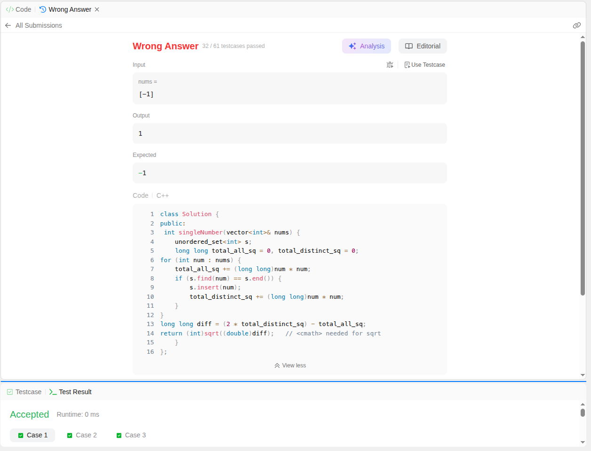

# 136. Single Number

| Field | Value |
|---|---|
| Question # | 136 |
| Title | Single Number |
| Difficulty | Easy |
| Topics | Array, Bit Manipulation |
| Link | https://leetcode.com/problems/single-number/description/ |

---

Given a **non-empty** array of integers `nums`, every element appears *twice* except for one. Find that single one.

You must implement a solution with a linear runtime complexity and use only constant extra space.

**Example 1:**

**Input:** nums = [2,2,1]

**Output:** 1

**Example 2:**

**Input:** nums = [4,1,2,1,2]

**Output:** 4

**Example 3:**

**Input:** nums = [1]

**Output:** 1

**Constraints:**

- `1 <= nums.length <= 3 * 104`
- `-3 * 104 <= nums[i] <= 3 * 104`
- Each element in the array appears twice except for one element which appears only once.

## Hints

1. Think about the XOR (^) operator's property.

---
---
Although the question was Hinting to use XOR but I have thought differnt Approaches:

>APPROACH 2 {not submitted as it above to time and space requirement in problem} --although it will run with success in leetcode

```
Sorting groups every duplicate pair adjacently. Scanning in twos, 
a matching pair means both belong to duplicates—skip past them. 
A mismatch means the current element has no partner nearby, so it must be the single, unpaired number.
```
### Complexity (of this implementation)
`Time: O(n log n)` — dominated by sort(). The while-loop itself is only O(n), but sorting is the bottleneck.
`Space: O(log n) to O(n)` — std::sort is typically introsort, which uses recursion internally for its 
quicksort partitioning; that recursion depth (typically O(log n), worst-case O(n) for certain implementations) counts as 
auxiliary space, even though you didn't allocate any array yourself.
        
```cpp
int i = 0;
int n = nums.size();
sort(nums.begin(), nums.end());
while(i< n-1){
    if(nums[i]==nums[i+1]){
        i = i+2;
    }
    else{
        return nums[i];
    }
}
return nums[i];
```
---

```
"Which operations let two equal things cancel out" — is actually a legitimate area of math called group theory. 
XOR forms what's called an abelian group on binary strings where every element is its own inverse 
(this property even has a name: an element with a * a = identity is called an involution, 
and a group where every element is an involution is sometimes informally called an "elementary abelian 2-group"). 
GCD and LCM don't form groups with this property at all (no consistent inverses, no identity behaving the way you need), 
which is why they can't substitute for XOR — not because of an implementation detail, 
but because of the underlying algebraic structure.
```

---
> APPROACH 3 (It takes two array and set difference )

```pseudocode
function singleNumber(nums):
    create an empty hash set, s
    for each num in nums:
        if num exists in s:
            erase num from s
        else:
            insert num into s

    return the only element left in s

```

### Intuition

>Treat the set as a toggle switch for each number: first sighting turns it "on" (insert), second sighting turns it "off" (erase).Every duplicate cancels itself out completely. Whatever's still "on" after the full scan never got a partner — that's the singleton.
```
Working (trace on [4,1,2,1,2])
4 → not in s → insert → {4}
1 → not in s → insert → {4,1}
2 → not in s → insert → {4,1,2}
1 → in s → erase → {4,2}
2 → in s → erase → {4}

End of loop: only 4 remains → return 4.
```
`Complexity`
`Time: O(n)` — single pass over nums; each count, insert, erase is O(1) average for unordered_set.
`Space: O(n)` — worst case, the set can grow to hold nearly n/2–n elements simultaneously before pairs get erased.
    -----

```cpp

        unordered_set<int> s;

        for (int num : nums) {
            if (s.count(num)) {
                s.erase(num);
            } else {
                s.insert(num);
            }
        }

        return *s.begin();

```
> A few things to notice as you read through it:

- s.count(num) returns 1 (truthy) or 0 (falsy), so it works directly as an if condition — no need to write s.count(num) == 1.
- The for (int num : nums) is the range-based for-loop — it hands you a copy of each element in turn, no manual indexing needed.
- *s.begin() — s.begin() gives an iterator to the single remaining element, and * dereferences it to pull out the actual value.


---
---
---
# Other Few Methods !!


## 1. "2 × Sum of Unique − Sum of All" trick

### Intuition & Working
If every element appeared exactly twice, then summing all distinct values and doubling it would exactly equal the sum of the full array — every value's contribution is accounted for twice, matching reality. The singleton breaks this symmetry: it only contributes **once** to the real total, but your doubled-distinct-sum still counts it **twice**. That mismatch is exactly the value of the singleton, and subtracting isolates it.

Think of it as a balance scale: `2×sum(distinct)` is what the total *should* be if nothing were singular. `sum(all)` is what it *actually* is. The gap between "should be" and "actually is" is precisely one extra copy of the lone number.

### Pseudocode
```
function singleNumber(nums):
    create empty set s
    total_all = 0
    total_distinct = 0

    for each num in nums:
        total_all = total_all + num
        if num not in s:
            insert num into s
            total_distinct = total_distinct + num

    return (2 * total_distinct) - total_all
```

### C++ syntax pieces
```cpp
unordered_set<int> s;
long total_all = 0, total_distinct = 0;

for (int num : nums) {
    total_all += num;
    if (s.find(num) == s.end()) {   // not present yet
        s.insert(num);
        total_distinct += num;
    }
}
return (2 * total_distinct) - total_all;
```
Note: `long` (or `long long`) is a safer accumulator type than `int` here — even though individual values are small, the *running sum* across up to 3×10⁴ elements is worth guarding against overflow, especially since values can be negative too (subtraction of negative sums can swing widely).

### Complexity
- **Time: O(n)** — one pass, O(1) average set operations.
- **Space: O(n)** — the set can hold up to n distinct values in the worst case (all-but-one-pair-unique scenario). Violates the O(1) space constraint.

---

## 2. Sum of squares variant

### Intuition & Working
Structurally identical cancellation logic to trick #1, just applied to squared values instead of raw values: `2×sum(distinct²) − sum(all²)` isolates `singleton²`, and you take a square root at the end to recover the actual number.

Why would anyone bother squaring instead of just using trick #1 directly? The reasoning some people give: squaring makes every term **non-negative**, which can feel like it avoids sign-related confusion when reasoning about the arithmetic by hand. In practice, this doesn't actually solve anything trick #1 didn't already handle correctly — it's more of a stylistic variant than a genuine improvement.

### Pseudocode
```
function singleNumber(nums):
    create empty set s
    total_all_sq = 0
    total_distinct_sq = 0

    for each num in nums:
        total_all_sq = total_all_sq + (num * num)
        if num not in s:
            insert num into s
            total_distinct_sq = total_distinct_sq + (num * num)

    diff = (2 * total_distinct_sq) - total_all_sq
    return sqrt(diff)
```
# Failed With some Cases Attached image


### C++ syntax pieces
```cpp
unordered_set<int> s;
long long total_all_sq = 0, total_distinct_sq = 0;

for (int num : nums) {
    total_all_sq += (long long)num * num;
    if (s.find(num) == s.end()) {
        s.insert(num);
        total_distinct_sq += (long long)num * num;
    }
}
long long diff = (2 * total_distinct_sq) - total_all_sq;
return (int)sqrt((double)diff);   // <cmath> needed for sqrt
```
Notice the explicit `(long long)` casts before multiplying — `num * num` on two `int`s computes in `int` arithmetic *before* being assigned, so without the cast you can silently overflow even though the destination variable is `long long`. This is a classic, easy-to-miss C++ trap.

### Complexity
- **Time: O(n)** — same structure as trick #1.
- **Space: O(n)** — same set requirement.
- **Extra risk**: overflow if you forget the `long long` cast, plus floating-point `sqrt` imprecision at large values — strictly more fragile than trick #1 for no real benefit.

---

## 3. Bit-counting per position

### Intuition & Working
Every integer, underneath, is just a fixed-width sequence of bits (commonly reasoned about as 32 bits for `int`). Instead of treating numbers as whole units, this technique looks at **one bit position at a time**, independently, across the entire array.

Fix your attention on, say, bit position 3. Go through every number in `nums` and count how many of them have a `1` sitting in that position. Every *duplicated* number contributes its bit at that position **exactly twice** (since it appears twice) — so duplicates always contribute an **even** amount to that position's count, no matter what the bit value is. The singleton, appearing once, tips that count by exactly one extra — flipping the total from even to odd (if its bit there is `1`), or leaving it even (if its bit there is `0`).

So the parity (odd/even) of the total count *at each bit position* directly reveals the corresponding bit of the singleton. Do this independently for all 32 positions, and you've reconstructed the singleton's entire binary representation — one bit at a time.

### Pseudocode
```
function singleNumber(nums):
    result = 0

    for bit_position from 0 to 31:
        count = 0
        for each num in nums:
            if bit at bit_position of num is 1:
                count = count + 1
        
        if count is odd:
            set bit_position in result to 1

    return result
```

### C++ syntax pieces
```cpp
int result = 0;

for (int bitPos = 0; bitPos < 32; bitPos++) {
    int count = 0;
    for (int num : nums) {
        if ((num >> bitPos) & 1) {   // extract bit at bitPos
            count++;
        }
    }
    if (count % 2 != 0) {
        result |= (1 << bitPos);    // set that bit in result
    }
}
return result;
```
Two operators worth understanding, not just copying:
- `(num >> bitPos) & 1` — shift `num` right by `bitPos` places so the bit you care about lands in position 0, then mask with `1` to isolate just that bit (everything else becomes 0).
- `result |= (1 << bitPos)` — `1 << bitPos` creates a number with only that one bit set (e.g., `1 << 3` = `0b1000`); OR-ing it into `result` sets that specific bit without disturbing any bits you've already set in earlier iterations.

### Complexity
- **Time: O(32n)**, which simplifies to **O(n)** since 32 is a fixed constant, not a variable that scales with input.
- **Space: O(1)** — only `result`, `count`, `bitPos` — no set, no array, no dependency on `n`.

This is the **only** one of the three that actually satisfies both of the problem's stated constraints simultaneously.

---

Worth sitting with: bit-counting is also the technique that **survives** the well-known follow-up (every element appears **three times** except one) — you'd just switch "count mod 2" to "count mod 3." XOR alone can't make that jump, since `a^a^a = a`, not `0`. 