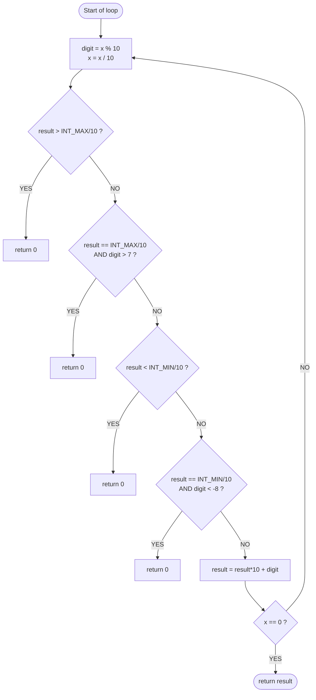

# 7. Reverse Integer

| Field | Value |
|---|---|
| Question # | 7 |
| Title | Reverse Integer |
| Difficulty | Medium |
| Topics | Math |
| Link | https://leetcode.com/problems/reverse-integer/description/ |
| Submission ID | 2081924726 |
| Submitted | 2026-07-26 11:01 UTC |

---

Given a signed 32-bit integer `x`, return `x` *with its digits reversed*. If reversing `x` causes the value to go outside the signed 32-bit integer range `[-231, 231 - 1]`, then return `0`.

**Assume the environment does not allow you to store 64-bit integers (signed or unsigned).**

**Example 1:**

```
Input: x = 123
Output: 321
```

**Example 2:**

```
Input: x = -123
Output: -321
```

**Example 3:**

```
Input: x = 120
Output: 21
```

**Constraints:**

- `-231 <= x <= 231 - 1`

---

## Submission

**Status:** Runtime Error  
**Language:** C++  

| Metric | Value |
|---|---|
| Runtime | N/A (beats 0%) |
| Memory | N/A (beats 0%) |
| Test cases | 12 / 1045 |

Solution: 
```cpp

class Solution {
public:
    int reverse(int x) {
        int result =0;
        for(int i=0; x !=0 ; i++){
        int digit = x % 10;
        x = x/10;
        result = result * 10 + digit;
        } 
        return result;   
    }
};

```


### Runtime error

```
Line 8: Char 25: runtime error: signed integer overflow: 964632435 * 10 cannot be represented in type 'int' (solution.cpp)
SUMMARY: UndefinedBehaviorSanitizer: undefined-behavior prog_joined.cpp:17:25
```
```cpp
class Solution {
public:
    int reverse(int x) {
        int result = 0;

        for ( ; x != 0 ; ) {
            int digit = x % 10;
            x = x / 10;   // integer division, truncates toward zero

            // BEFORE updating result, check if result*10 + digit would overflow

            // ------------------------------------------------------------
            // Condition 1: result > INT_MAX / 10
            // ------------------------------------------------------------
            // If `result` is already bigger than 214748364, then even
            // multiplying by 10 alone (before adding any digit) guarantees
            // you blow past 2147483647. No need to check the digit —
            // it's already too big.
            if (result > INT_MAX / 10) {
                // "return 0" here means: we detected that continuing would
                // cause the reversed number to exceed the 32-bit int range.
                // Per the problem's rules, instead of overflowing (undefined
                // behavior), we abandon the reversal early and report 0
                // as the designated "invalid/overflow" result.
                return 0;
            }

            // ------------------------------------------------------------
            // Condition 2: result == INT_MAX / 10 and digit > 7
            // ------------------------------------------------------------
            // If `result` is exactly 214748364, you're right at the edge.
            // Multiplying gives 2147483640. Now the digit you're about to
            // add matters:
            //   Max safe digit: 2147483647 - 2147483640 = 7
            // So if digit > 7 (i.e., 8 or 9), you overflow.
            // If digit <= 7, you're safe.
            if (result == INT_MAX / 10 && digit > 7) {
                // Same meaning as above: this is the exact boundary case
                // where result is right at the edge, and the incoming digit
                // would push the total past INT_MAX. We stop and return 0
                // rather than let result*10 + digit silently overflow.
                return 0;
            }

            // ------------------------------------------------------------
            // Condition 3: result < INT_MIN / 10
            // ------------------------------------------------------------
            // Same logic as Condition 1, but for the negative boundary.
            // If `result` is already less than -214748364, multiplying by
            // 10 alone overflows past -2147483648.
            if (result < INT_MIN / 10) {
                // "return 0" again signals overflow detected — this time on
                // the negative side. We exit before the multiplication can
                // push result below INT_MIN.
                return 0;
            }

            // ------------------------------------------------------------
            // Condition 4: result == INT_MIN / 10 and digit < -8
            // ------------------------------------------------------------
            // Mirrors Condition 2. At the exact boundary -214748364,
            // multiplying gives -2147483640. The most negative digit you
            // can safely add is -8 (since -2147483648 - (-2147483640) = -8).
            // If digit < -8, overflow.
            //
            // (Note: digit from x % 10 can be negative when x is negative —
            // that's why conditions 3/4 compare against negative digit values.)
            if (result == INT_MIN / 10 && digit < -8) {
                // Exact negative boundary case — the incoming digit would
                // push result below INT_MIN. We stop here and return 0
                // instead of letting the multiplication overflow.
                return 0;
            }

            result = result * 10 + digit;
        }

        return result;
    }
};
```


